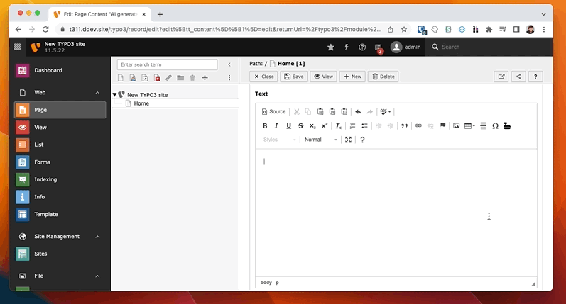

# T3 cowriter

Did you ever whish to have a second person to work on a TYPO3 page together with you? This extension allows you to do so. With the help of ai you can now work on a page together with a cowriter - a digital assistant that helps you to write your content.



## Installation

Currently the extension is not available via TER.
Install the extension via composer:

```bash
composer require netresearch/t3-cowriter
```

## Configuration

1. Create a new API key at [https://openai.com/api/](https://openai.com/api/)
2. Add the API key to your TYPO3 Extension configuration (Extension Manager -> Settings -> Extension Configuration -> t3_cowriter)

## Functionality

1. You'll get a new button in your editor for content elements.
2. Press the button and enter a description for the text you want to generate

## License

This project is licensed under the GNU AFFERO GENERAL PUBLIC License - see the [LICENSE](LICENSE) file for details.
